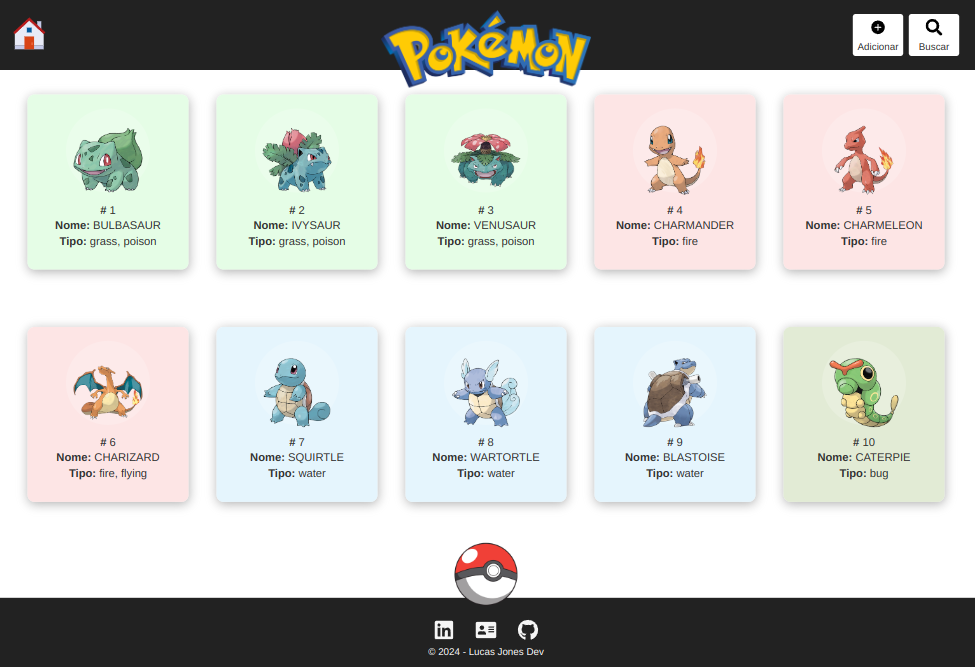

# Pokedex

<table>
    <tr>
        <th colspan="2">
            <a href="https://pokedex-lucasjcfreire.vercel.app/" title="Clique para acessar o deploy">
                
                
Clique para acessar o deploy!

            </a>
        </th>
    </tr>
    <tr>
        <th style="width: 50%;">
             
            English
        </th>
        <th style="width: 50%;">
             
            Portuguese
        </th>
    </tr>
    <tr>
        <th>
About the Project
</th>
        <th>
Sobre o Projeto
</th>
    </tr>
    <tr>
        <td>
            
The goal of this project was to develop a Pokédex in React, using the Pokémon API with functionalities to list, add, edit, and delete Pokémon. To optimize development and performance, I used Vite as the bundler and React as the main library, along with React Router DOM for navigation, React Icons for icons, and Styled Components for styling. Additionally, I used Biome.js to ensure code standardization and quality.

        </td>
        <td>
            
Este projeto teve como objetivo desenvolver uma Pokédex em React, utilizando a API Pokémon com funcionalidades de listar, adicionar, editar e excluir Pokémons. Para otimizar o desenvolvimento e a performance, utilizei Vite como bundler e React como biblioteca principal, juntamente com as bibliotecas React Router DOM para navegação, React Icons para ícones e Styled Components para estilização. Além disso, utilizei Biome.js para garantir a padronização e qualidade do código.

        </td>
    </tr>
    <tr>
        <th>
Skills / Techniques
</th>
        <th>
Habilidades / Técnicas
</th>
    </tr>
    <tr>
        <th colspan="2">
            
            
            
            
            
        </th>
    </tr>
    <tr>
        <th>
Download Project
</th>
        <th>
Baixar Projeto
</th>
    </tr>
    <tr>
        <td>
            
Clone the repository using the command

        </td>
        <td>
            
Clone o repositório com o comando

        </td>
    </tr>
    <tr>
        <th colspan="2">
            <code>git clone git@github.com:LucasJCFreire/pokedex.git</code>
        </th>
    </tr>
    <tr>
        <td>
            
Navigate into the project folder and install dependencies with:

        </td>
        <td>
            
Navegue até a pasta do projeto e instale as dependências com:

        </td>
    </tr>
    <tr>
        <th colspan="2">
            <code>cd pokedex && npm install</code>
        </th>
    </tr>
    <tr>
        <td>
            
Run the project with the following command:

        </td>
        <td>
            
Execute o projeto com o comando:

        </td>
    </tr>
    <tr>
        <th colspan="2">
            <code>npm run dev</code>
        </th>
    </tr>
    <tr>
        <th>
Comments and Feedback
</th>
        <th>
Comentários e Feedback
</th>
    </tr>
    <tr>
        <td>
I am very happy with your visit. Please feel free to explore my work and contact me.
</td>
        <td>
Fico muito feliz com a sua visita. Sinta-se à vontade para explorar meu trabalho e entrar em contato comigo.
</td>
    </tr>
    <tr>
        <th colspan="2">
            
Lucas Jones - Frontend Developer

            
            
            
            
            
        </th>
    </tr>
    <tr>
        <th colspan="2">
            <a href="https://github.com/LucasJCFreire/challenges" title="Explore mais desafios clicando aqui">
                
                
Explore mais desafios clicando aqui!

            </a>
        </th>
    </tr>
</table>
